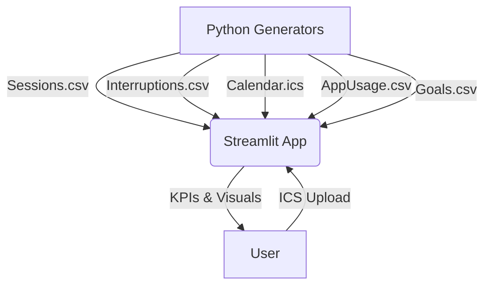

# Smart Task Reminder – Project Report

## 1. Executive Summary
The Smart Task Reminder initiative delivers a production-ready Streamlit “control room” that fuses focus-scoring intelligence, distraction analytics, calendar context, and goal accountability into a single, reproducible workspace. Mock telemetry (sessions, interruptions, calendar, app usage, and goal progress) is generated with deterministic Python scripts so every stakeholder can replay identical scenarios for validation, experimentation, and storytelling. The application replaces the original Power BI concept with a richer, responsive experience tailored to the project’s four functional requirements (FR1–FR4) plus UC3.1 (.ics ingestion).

## 2. Scope & Objectives
- **FR1 – Intelligent Focus Scoring Engine:** Compute FocusScore, DeepWork%, and productivity deltas using metrics derived from session depth, completion quality, and tab-switch friction.
- **FR2 – Cognitive Distraction Analytics:** Quantify interruption loss and social/app waste through Pareto charts, heatmaps, time-series, and tabular insights.
- **FR3 – Calendar-Aware Workload Mapping:** Parse VEVENTs from `.ics`, surface busy windows, and highlight the Focus Energy curve to recommend optimal blocks.
- **FR4 – Weekly Insight Story:** Present KPI cards, wasted-time breakdowns, goal progress, and recommendations in a narrative-friendly layout (no PDF dependency).
- **UC3.1 – Upload & Parse Calendar:** Allow analysts to drag/drop a calendar file and instantly see its impact on the workload map.

## 3. Research & Methodology
| Stream | Research Inputs | Implementation Notes |
| --- | --- | --- |
| Productivity heuristics | Studies on deep work thresholds (45+ mins, <5 tab switches) and Pomodoro practices | Encoded as tunable formulas in `enrich_sessions()` |
| Distraction analytics | Pareto principle (80/20), context switching costs, time-of-day fatigue curves | FR2 visuals (Pareto, heatmap, app usage) and FR1 Focus Energy curve |
| Calendar fusion | UC3.1 requirement + ICS RFC5545 spec | Parser extracts DTSTART/DTEND/SUMMARY with UTC handling |
| Goal accountability | OKR-style cadence, progress bars for target vs actual | `Goals.csv` + Streamlit progress components |

## 4. System Architecture

### Data Generation Pipeline
- `generate_sessions.py`: 4-week timeline, 1–4 sessions/day with realistic durations and outcomes.
- `generate_interruptions.py`: 0–3 events per session, referencing Session IDs for integrity.
- `generate_calendar_ics.py`: 30 VEVENTS across weekdays in UTC.
- `generate_app_usage.py`: Minutes spent across productive vs distracting apps.
- `generate_goals.py`: Target vs actual minutes with status flags.

### Streamlit Layers
1. **Caching Layer:** `@st.cache_data` for all loaders to avoid I/O churn.
2. **Computation Layer:** `enrich_sessions`, `compute_metrics`, `compute_insights`, `generate_recommendations`.
3. **Visualization Layer:** Plotly charts (line, bar, pie, area, timeline, heatmap) + custom CSS metric cards.
4. **Interaction Layer:** Tabs for Overview, Focus Engine, Distraction Radar, Calendar Map, Goals & Actions; ICS uploader; recommendations panel.

## 5. Functional Realization
| Requirement | Implementation | Evidence |
| --- | --- | --- |
| FR1 | KPI cards + daily trend + TaskType bar + Focus Energy curve | `app.py` lines 210–310 & Focus tab |
| FR2 | Pareto, heatmap, app usage trend, top distraction table | `plot_pareto`, `plot_interruption_heatmap`, `plot_app_usage` |
| FR3 | ICS parser, timeline, suggested focus window | `parse_calendar`, Calendar tab, success banner |
| FR4 | Overview + Goals tabs with narrative metrics and recommendations | metric cards + donut + playbook |
| UC3.1 | `st.file_uploader` + dynamic parse + fallback messaging | Calendar tab |

## 6. Azure DevOps / Sprint Alignment
| Board Item | Status | Notes |
| --- | --- | --- |
| Story #101 – Focus Scoring Engine | Done | Session enrichment + KPIs |
| Story #102 – Distraction Analytics | Done | Pareto, heatmap, app usage |
| Story #103 – Calendar Fusion | Done | ICS parser + timeline + best hour |
| Story #104 – Weekly Insight Narrative | Done | Tabs, recommendations, goals |
| Story #105 – Data Reproducibility Scripts | Done | Five Python generators |
| Bug #31 – PDF Encoding Failure | Closed | Removed PDF dependency & updated docs |
| Bug #32 – Plotly Hour column crash | Closed | HourOfDay rename fix |

## 7. Testing Summary
- **Unit:** duration non-negative, tab-switch capping, DeepWork guardrails, app-label validation.
- **Integration:** ICS alignment, Pareto totals, wasted-time KPI math.
- **Functional:** Tab navigation smoke test, ICS upload, goals/recommendations refresh.
- **Regression:** Re-run all generators → Streamlit refresh.

## 8. Risks & Mitigations
| Risk | Impact | Mitigation |
| --- | --- | --- |
| Real calendars vary in timezone formats | incorrect Busy rendering | enforce UTC conversion + add warning |
| Mock data too static for demos | stale insights | re-run generators with new seeds per sprint |
| Recommendations feel generic | lower adoption | extend rule set with persona toggles |

## 9. Future Enhancements
- Live calendar + communication integrations (Google, Outlook, Slack API).
- Personalization toggles (persona, working hours, goals weighting).
- Insight export service (PDF/email) once Unicode-friendly fonts are bundled.
- ML-based anomaly detection on FocusScore deltas.

## 10. Conclusion
The Smart Task Reminder project now offers a visually rich, reproducible platform showcasing FR1–FR4, UC3.1, and sprint-readiness messaging. Documentation, datasets, and the Streamlit experience equip stakeholders for demos, sprint check-ins, and future research extensions.
